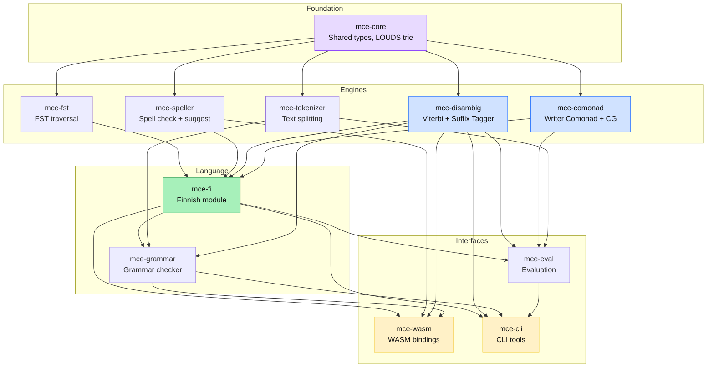
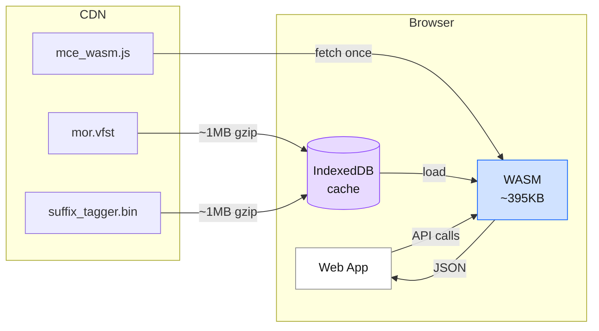

# Architecture

MCE processes Finnish text through four computational machines, each grounded in a different mathematical model. The entire system compiles to a ~395KB WASM module that runs offline in the browser.

## The Big Picture

```mermaid
flowchart LR
  Input["Raw Text"] --> T["Tokenizer"]
  T --> M1["M1: Succinct Trie<br/>Dictionary lookup"]
  M1 --> M2["M2': Comonadic Engine<br/>Morphophonological rules"]
  M2 --> M3["M3: Pushdown Transducer<br/>Compound analysis"]
  M3 --> M4["M4': Weighted Lattice<br/>Disambiguation"]
  M4 --> Out["Analyzed output"]

  style Input fill:#d0e2ff,color:#161616,stroke:#0f62fe
  style Out fill:#a7f0ba,color:#161616,stroke:#198038
  style T fill:#ffffff,color:#161616,stroke:#8d8d8d
  style M1 fill:#ffffff,color:#161616,stroke:#8d8d8d
  style M2 fill:#e8daff,color:#161616,stroke:#8a3ffc
  style M3 fill:#ffffff,color:#161616,stroke:#8d8d8d
  style M4 fill:#ffffff,color:#161616,stroke:#8d8d8d
```



### Why four machines?

Existing Finnish NLP systems fall into two camps. Rule-based systems (Omorfi, Voikko) use a single monolithic FST that handles everything — lookup, morphophonology, compounding — in one transducer. Neural systems (TurkuNLP, Trankit) use a single monolithic transformer. Both work, but neither fits the browser: FSTs are too large to ship as-is (Omorfi's HFST binary is ~100MB), and transformers require GPU servers.

MCE takes a different approach: **decompose the problem into four heterogeneous computation models, each optimal for its subproblem.** A succinct trie (M1) is optimal for dictionary lookup in constrained memory. A comonad (M2) is optimal for composing character-level rules that involve deletion. A pushdown transducer (M3) is optimal for context-free compound decomposition. A weighted lattice (M4) is optimal for sequence disambiguation under uncertainty.

This decomposition is the core architectural idea. No single formalism handles all four subproblems well — FSTs struggle with disambiguation, neural models are overkill for dictionary lookup, and neither provides a principled composition algebra for deletion rules. By matching each subproblem to its natural mathematical model, MCE achieves near-neural accuracy (94.58% UPOS) in ~395KB of WASM — a size reduction of three to four orders of magnitude compared to transformer-based systems.

The most unusual choice is M2: using a **Writer Comonad** from category theory for morphophonological rules. This is, as far as we know, the first use of comonads in a production NLP system. The motivation was specific: Finnish consonant gradation deletes characters, and deletion breaks the standard FST composition pipeline. The Writer Comonad solves this by accumulating deletions as a monoid side-channel, keeping positions stable so that rules compose purely. The details are in [The Writer Comonad](#the-writer-comonad) below.

## How a Sentence Flows Through

Consider analyzing **"Koirat juoksevat nopeasti."** (Dogs run quickly.)

**Tokenize** — The tokenizer produces four tokens: `Koirat`, `juoksevat`, `nopeasti`, `.`

**Look up** — The FST transducer finds all valid morphological readings. `Koirat` could be nominative plural OR accusative plural of *koira* (dog). `juoksevat` is unambiguous: third-person plural present of *juosta* (to run).

**Apply rules** — The Writer Comonad applies consonant gradation and vowel harmony as pure coKleisli arrows. For this sentence, no gradation fires, but the machinery is ready for words like *kauppa* → *kaupan* (pp → p).

**Prune and score** — CG rules eliminate impossible readings based on context (sentence-initial favors nominative over accusative). The suffix tagger assigns emission scores, and Viterbi finds the optimal sequence: NOUN → VERB → ADV → PUNCT.

**Output** — Each token gets a single disambiguated analysis with lemma, POS tag, and morphological features.

## Crate Structure



The workspace has 11 crates organized in four layers:

**Foundation.** `mce-core` defines the shared vocabulary — `Analysis`, `Token`, character classification, and the LOUDS succinct trie. It has no internal dependencies, so every other crate can rely on it without risk of cycles.

**Engines.** Five crates that each own one computational concern. `mce-fst` handles FST binary format parsing and transducer traversal. `mce-tokenizer` splits text. `mce-comonad` implements the Writer Comonad, coKleisli arrows, and Constraint Grammar rules — the algebraic half of the system. `mce-disambig` implements Viterbi decoding and the suffix tagger — the statistical half. `mce-speller` does spell checking and suggestion generation. These crates are deliberately independent of each other: comonad doesn't know about FST formats, and disambig doesn't know about comonads.

**Language.** `mce-fi` is the Finnish integration point — it pulls together FST lookup, comonadic rules, spelling, and disambiguation into a coherent analysis pipeline. `mce-grammar` adds sentence-level error checking on top. If MCE were extended to Turkish or Hungarian, `mce-fi` would be replaced while the engine crates stay unchanged.

**Interfaces.** `mce-wasm` exposes 22 JavaScript API methods via wasm-bindgen. `mce-cli` provides 11 command-line tools. `mce-eval` benchmarks accuracy against UD treebanks. Crucially, `mce-wasm` never depends on `mce-eval` — evaluation code with filesystem I/O never ships to the browser.

## Why This Structure

The four-machine decomposition dictates the crate boundaries naturally. Each machine maps to one or two engine crates, and the separation serves both mathematical clarity and practical engineering:

**WASM must stay small.** Only `mce-wasm` and its transitive dependencies compile to WebAssembly. Evaluation, CLI, and test infrastructure are excluded at the type level — not by convention, but because they live in separate crates that `mce-wasm` simply doesn't depend on.

**Algebra and statistics don't mix.** `mce-comonad` (Writer Comonad, coKleisli composition, CG rules) and `mce-disambig` (Viterbi, logistic regression, emission priors) implement fundamentally different computational models. Separating them keeps each crate's invariants clear and makes it possible to reason about correctness independently.

**Language logic is pluggable.** `mce-fi` is the only crate that knows Finnish-specific facts (vowel harmony patterns, linking morphemes, case suffixes). Everything below it — FST traversal, comonadic composition, statistical disambiguation — works on abstract `Analysis` values and could serve any agglutinative language.

**Cherry-pick provenance is clear.** About 25% of the code was adapted from corevoikko. The crate boundaries align with the source: `voikko-core` → `mce-core`, `voikko-fst` → `mce-fst`, `voikko-fi/tokenizer` → `mce-tokenizer`. Code written from scratch (`mce-comonad`, `mce-disambig`, `mce-grammar`) lives in separate crates with no corevoikko ancestry.

## The Writer Comonad

The most distinctive architectural choice is using a **Writer Comonad** for morphophonological rules.

The problem: Finnish consonant gradation deletes characters (*kaappi* → *kaapin*, removing one `p`). In a traditional pipeline, deletions are handled with sentinel characters (`\0`) that get filtered between steps. But this breaks composition — intermediate nulls shift positions for subsequent rules.

The solution: Each rule is a **coKleisli arrow** over a `WriterZipper<DeletionSet, char>`. Instead of mutating the string, it returns a set of positions to delete. The `extend` combinator applies the arrow at every position and unions all deletion sets. Multiple rules compose purely — `extend(gradation) . extend(harmony)` — with no intermediate materialization. Deletions are applied once at the very end.

```rust
// Each morphophonological rule has this signature:
fn gradation(w: &WriterZipper<DeletionSet, char>) -> (DeletionSet, char)
fn harmony(w: &WriterZipper<DeletionSet, char>) -> (DeletionSet, char)

// Composition is just function chaining:
let pipeline = |input| {
    let after_grad = writer.extend(gradation);
    let after_harm = after_grad.extend(harmony);
    after_harm.materialize()  // apply all deletions once
};
```

This gives us 11 consonant gradation patterns and vowel harmony as composable, testable, pure functions — with comonad laws (identity and associativity) verified by 44 unit tests.

## WASM Deployment



The browser loads three assets: the WASM module (~395KB), the Finnish dictionary (3.8MB), and optionally the suffix tagger model (5.0MB) — totaling ~9.2MB (~2-3MB gzip). After the first load, the dictionary and model are cached in IndexedDB — subsequent visits require zero network. All computation runs locally; no text ever leaves the device.
