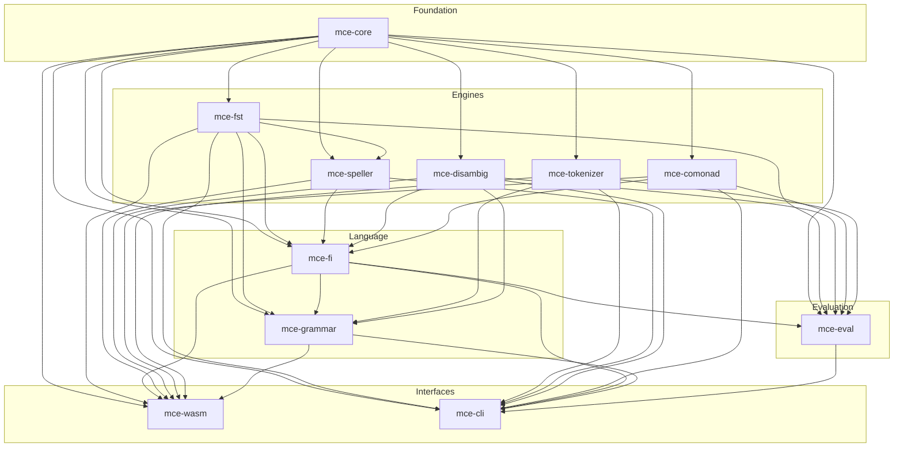
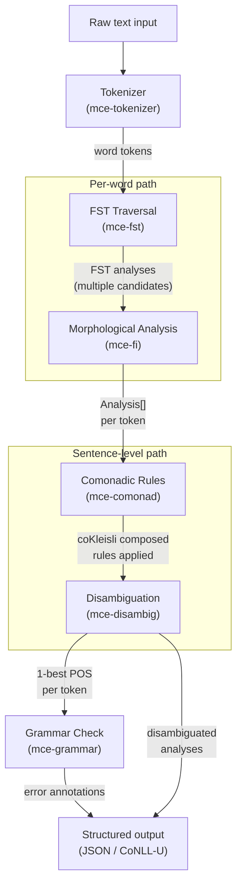
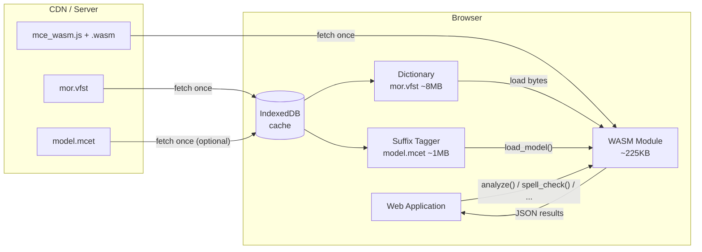
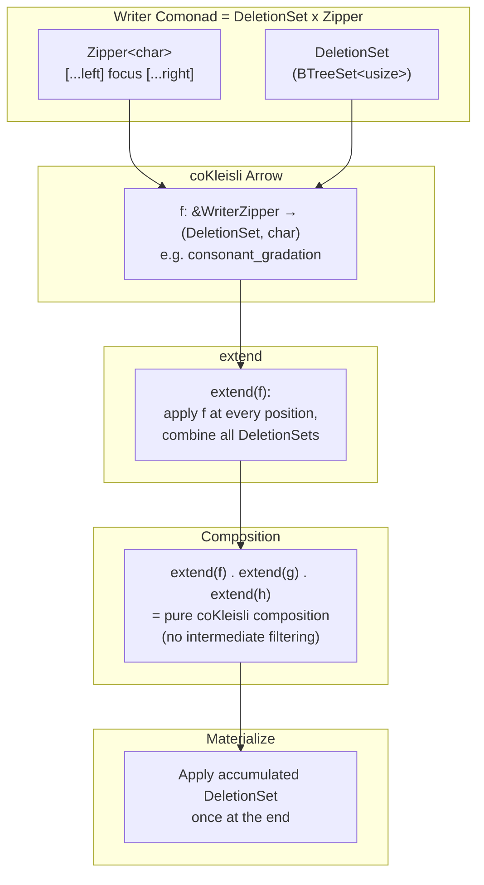

# Architecture

MCE (Morphological Computation Engine) is a Rust workspace of 11 crates that implements Finnish morphological analysis, spell checking, grammar checking, hyphenation, and disambiguation. It compiles to a ~225KB WASM module that runs entirely in the browser with no server, targeting <5ms per sentence at 95.56% UPOS accuracy.

## Crate Map



| Crate | Role | LOC | Dependencies |
|-------|------|----:|-------------|
| `mce-core` | Shared types: `Analysis`, `Token`, character classification, LOUDS succinct trie | ~3,000 | (none) |
| `mce-fst` | FST engine: VFST format parser, flag diacritics, transducer traversal | ~1,700 | `mce-core` |
| `mce-tokenizer` | Text tokenizer: word, URL, email, sentence boundary detection | ~1,400 | `mce-core` |
| `mce-comonad` | Writer Comonad engine: `Zipper`, `WriterZipper`, `DeletionSet`, coKleisli arrows, CG rules, Finnish morphophonology (vowel harmony, consonant gradation, allomorph selection) | ~8,400 | `mce-core` |
| `mce-disambig` | Disambiguation: Viterbi decoder, emission priors, suffix tagger (95.56% UPOS), CG-lite (62 active rules) | ~5,800 | `mce-core` |
| `mce-speller` | Spell checking and suggestion generation with edit-distance ranking | ~1,900 | `mce-core`, `mce-fst` |
| `mce-fi` | Finnish language module: morphological analyzer, hyphenator, compound analysis | ~7,100 | `mce-core`, `mce-fst`, `mce-speller`, `mce-disambig`, `mce-comonad` |
| `mce-grammar` | Grammar checker: 21 Finnish grammar rules with context-sensitive paragraph analysis | ~6,400 | `mce-core`, `mce-fst`, `mce-fi`, `mce-tokenizer`, `mce-disambig` |
| `mce-eval` | Evaluation harness: UPOS accuracy against UD treebanks (Finnish-TDT) | ~2,700 | `mce-core`, `mce-fst`, `mce-fi`, `mce-disambig`, `mce-comonad`, `mce-tokenizer` |
| `mce-wasm` | WASM bindings: 20 JavaScript API methods via `wasm-bindgen` | ~2,000 | `mce-core`, `mce-fst`, `mce-fi`, `mce-speller`, `mce-disambig`, `mce-comonad`, `mce-tokenizer`, `mce-grammar` |
| `mce-cli` | CLI tools for interactive analysis, evaluation, and debugging | ~1,500 | all crates |

Total: ~41,800 lines of Rust, 1,365 tests.

## Pipeline Architecture (MCE v3)

MCE v3 organizes computation into four machines, each with a distinct mathematical basis:

```mermaid
flowchart LR
    subgraph M1["M1: Succinct Trie"]
        direction TB
        m1a[LOUDS encoding]
        m1b[Dictionary lookup]
        m1c[Spelling check]
    end

    subgraph M2["M2': Comonadic Engine"]
        direction TB
        m2a["Zipper (focus + context)"]
        m2b[coKleisli arrows]
        m2c["extend = global transform"]
        m2d["Writer Comonad (DeletionSet)"]
    end

    subgraph M3["M3: PDT Compound"]
        direction TB
        m3a[Pushdown Transducer]
        m3b[Compound word parsing]
        m3c[Stack-based structure]
    end

    subgraph M4["M4': Weighted Lattice"]
        direction TB
        m4a[Viterbi decoder]
        m4b[Emission priors]
        m4c[Suffix tagger]
        m4d["CG-lite (57 rules)"]
    end

    M1 --> M2 --> M3 --> M4
```



| Machine | Crate | Math basis | Function |
|---------|-------|-----------|----------|
| **M1: Succinct Trie** | `mce-core` (trie module) | LOUDS encoding | Dictionary lookup, spell checking. O(n) lookup, O(k) fuzzy match. |
| **M2': Comonadic Engine** | `mce-comonad` | Writer Comonad (`extend`/`extract`) | Morphophonological rules as composable coKleisli arrows. Consonant gradation (11 patterns), vowel harmony, allomorph selection, CG-lite rules. |
| **M3: PDT** | `mce-fst` | Pushdown Transducer | Compound word structure analysis. Context-free decomposition of Finnish compounds (e.g., `rautatieasema` -> `rauta+tie+asema`). |
| **M4': Weighted Lattice** | `mce-disambig` | Viterbi + Emission Priors | 1-best disambiguation. POS bigram model + suffix tagger emissions. Rule-only: 82.71% UPOS; with suffix tagger: 95.56% UPOS. |

## Data Flow



**Step-by-step**:

1. **Tokenize** -- `mce-tokenizer` splits raw text into word, punctuation, URL, and sentence boundary tokens.
2. **FST Traverse** -- `mce-fst` runs the VFST transducer over each word token, producing all valid morphological decompositions.
3. **Analyze** -- `mce-fi` wraps FST output into structured `Analysis` objects with attributes (CLASS, BASEFORM, STRUCTURE, etc.).
4. **Comonadic Rules** -- `mce-comonad` applies morphophonological transformations as coKleisli arrows: consonant gradation, vowel harmony, allomorph selection. The Writer Comonad accumulates deletion marks algebraically.
5. **Disambiguate** -- `mce-disambig` selects the best analysis per token using Viterbi decoding with POS bigram transitions, emission priors, CG-lite constraint rules (62 active), and optionally the suffix tagger.
6. **Grammar Check** -- `mce-grammar` scans the disambiguated sentence for grammar errors (21 rules).

## WASM Deployment



**Deployment sizes** (gzip):

| Asset | Raw | Gzip |
|-------|----:|-----:|
| WASM module | ~225KB | ~100KB |
| Dictionary (mor.vfst) | ~8MB | ~1MB |
| Suffix tagger (model.mcet) | ~5MB | ~1MB |
| **Total** | **~13MB** | **~2.1MB** |

**Loading strategy**:

1. Browser fetches `mce_wasm.js` + `.wasm` from CDN.
2. Dictionary and model are fetched once, cached in IndexedDB.
3. On subsequent visits, dictionary and model load from cache (zero network).
4. `MceEngine.load(dictBytes)` initializes the engine.
5. `engine.load_model(modelBytes)` optionally enables the suffix tagger (82.71% -> 95.56% UPOS).
6. All 20 API methods (`analyze`, `spell_check`, `suggest`, `hyphenate`, `grammar_check`, `analyze_sentence`, etc.) run synchronously in the main thread or a Web Worker.

## Mathematical Foundation: Writer Comonad

The central mathematical contribution is using the **Writer Comonad** to achieve pure coKleisli composition for morphophonological rules that involve character deletion.



**Why it matters**:

Without the Writer Comonad, consonant gradation (e.g., `pp` -> `p`, deleting one character) requires inserting `'\0'` sentinel characters, then filtering between pipeline steps. This breaks coKleisli composition because intermediate null characters shift positions for subsequent rules.

With `WriterZipper<DeletionSet, char>`:
- Each coKleisli arrow returns `(DeletionSet::singleton(pos), original_char)` for deletions.
- `extend` combines all deletion sets via set union (the monoidal operation).
- Deletions are applied once at the end -- positions stay stable throughout the pipeline.
- The comonad laws (identity and associativity) hold without qualification.

```
gradation : &WriterZipper<DeletionSet, char> -> (DeletionSet, char)
harmony   : &WriterZipper<DeletionSet, char> -> (DeletionSet, char)
possessive: &WriterZipper<DeletionSet, char> -> (DeletionSet, char)

pipeline = extend(gradation)
         . extend(harmony)
         . extend(possessive)
         -- pure composition, no intermediate materialization
```

## Performance Characteristics

| Metric | Value | Notes |
|--------|------:|-------|
| UPOS accuracy (rule-only) | 82.71% | CG-lite rules + Viterbi |
| UPOS accuracy (+ suffix tagger) | 95.56% | CG + Viterbi + emission model |
| Lemmatization accuracy | 86.24% | FST-based |
| Dictionary coverage | 99.64% | Finnish-TDT test set |
| Throughput | 42,000 tok/s | Native, single-threaded |
| Latency target | <5ms/sentence | ~20 tokens average sentence |
| WASM binary | ~225KB | `opt-level = "z"`, LTO, `panic = "abort"` |
| CG rules | 62 active / 85 total | coKleisli arrows in `mce-comonad` |
| Grammar rules | 21 | Context-sensitive paragraph rules |
| Morphological generation | 11 noun cases + 4 verb types | coKleisli composition |
| Test count | 805 | `cargo test --all-features` |

Build profile (`Cargo.toml`):
```toml
[profile.release]
opt-level = "z"      # optimize for size
lto = true           # link-time optimization
codegen-units = 1    # single codegen unit for better optimization
strip = true         # strip debug symbols
panic = "abort"      # no unwinding overhead
```

## ASCII Diagrams (Terminal-Friendly)

For terminal environments where mermaid rendering is unavailable, here are ASCII equivalents of key diagrams.

### Crate Dependency Graph

```
                           ┌─────────┐
                           │mce-core │
                           └────┬────┘
            ┌──────┬───────┬────┼────┬────────┬──────────┐
            │      │       │    │    │        │          │
            ▼      ▼       ▼    ▼    ▼        ▼          ▼
        ┌──────┐┌─────┐┌─────┐┌──────┐┌────────┐┌─────────┐
        │ fst  ││ tok ││como ││disam ││speller ││  (fi)   │
        └──┬───┘└──┬──┘└──┬──┘└──┬───┘└───┬────┘└────┬────┘
           │       │      │      │        │          │
           ├───────┼──────┼──────┼────────┘          │
           │       │      │      │                   │
           ▼       │      ▼      ▼                   │
        ┌──────────┼──────────────────┐              │
        │  mce-fi  │                  │◄─────────────┘
        └────┬─────┘                  │
             │                        │
     ┌───────┼────────────────────────┤
     │       │                        │
     ▼       ▼                        ▼
 ┌────────┐┌──────┐              ┌────────┐
 │grammar ││ eval │              │  wasm  │
 └────────┘└──────┘              └────────┘
                                      │
                                 (all above)
                                      │
                                 ┌────────┐
                                 │  cli   │
                                 └────────┘
```

### MCE v3 Pipeline

```
 ┌─────────────────┐   ┌──────────────────────┐   ┌──────────┐   ┌─────────────────┐
 │  M1: Succinct    │   │  M2': Comonadic       │   │  M3: PDT  │   │ M4': Weighted    │
 │      Trie        │──▶│       Engine           │──▶│ Compound  │──▶│     Lattice      │
 │                  │   │                        │   │           │   │                  │
 │  LOUDS encoding  │   │  Zipper + extend       │   │  Pushdown │   │  Viterbi +       │
 │  Dictionary O(n) │   │  coKleisli arrows      │   │  Stack    │   │  Suffix Tagger   │
 │  Fuzzy O(k)      │   │  Writer(DeletionSet)   │   │  O(n*k)   │   │  CG-lite (57)    │
 └─────────────────┘   └──────────────────────┘   └──────────┘   └─────────────────┘
```

### Analysis Data Flow

```
 "Koira juoksee nopeasti."
         │
         ▼
 ┌───────────────┐
 │  Tokenizer    │  word / punct / URL / sentence boundaries
 └───────┬───────┘
         │  ["Koira", "juoksee", "nopeasti", "."]
         ▼
 ┌───────────────┐
 │  FST Traverse │  VFST transducer → all valid decompositions
 └───────┬───────┘
         │  Koira → [{nimisana, koira, NOM.SG}, {nimisana, koira, NOM.PL}, ...]
         ▼
 ┌───────────────┐
 │  Comonadic    │  extend(gradation) . extend(harmony) . extend(...)
 │  Rules        │  Writer Comonad accumulates deletions
 └───────┬───────┘
         │
         ▼
 ┌───────────────┐
 │  Disambig     │  Viterbi 1-best: NOUN VERB ADV PUNCT
 │  (M4')        │  82.71% rule-only → 95.56% with suffix tagger
 └───────┬───────┘
         │
         ▼
 ┌───────────────┐
 │  Grammar      │  21 rules: repeated words, case agreement, ...
 └───────┬───────┘
         │
         ▼
 Structured output (JSON)
```

## Note on MonoSketch

[MonoSketch](https://monosketch.io/) is an open-source, browser-based ASCII diagram editor (Kotlin/JS) by tuanchauict. It provides an interactive canvas for drawing boxes, lines, and text using Unicode box-drawing characters -- exactly the kind of diagrams shown above. It could be a useful tool for creating and editing the ASCII diagrams in this document interactively, though for version-controlled documentation the hand-crafted ASCII art above is sufficient.
