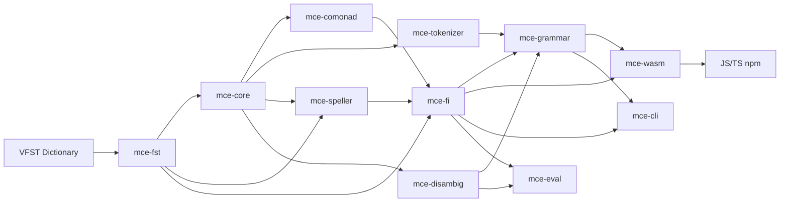

# MCE — Morphological Computation Engine

Browser-first Finnish NLP engine -- morphological analysis, POS tagging, spell checking, grammar checking, hyphenation, compound analysis, and morphological generation, all running offline in WebAssembly.

MCE uses a mathematically grounded architecture: a Writer Comonad for morphophonological rules, Constraint Grammar for disambiguation, and a suffix-based statistical tagger -- achieving 95.56% UPOS accuracy in 225KB of WASM with no server required.

## Features

- **Morphological analysis** with full inflection details and POS disambiguation
- **POS tagging** at 95.56% UPOS accuracy (CG + Suffix Tagger)
- **Spell checking** with compound word and derivation support
- **Spelling suggestions** with context-aware ranking
- **Grammar checking** with 21 rule-based checks
- **Hyphenation** with compound-aware syllable splitting
- **Compound word analysis** with 6 linking morpheme types
- **Morphological generation** for nouns (11 cases) and verbs (4 conjugation types)
- **Sentence-level disambiguation** via Viterbi + Constraint Grammar + Suffix Tagger
- **Writer Comonad** pipeline for morphophonological rules (consonant gradation, vowel harmony)

## Quick Start

### npm (Browser / Node.js)

```bash
npm install @yongsk0066/mce
```

```typescript
import init, { MceEngine } from '@yongsk0066/mce';

await init();
const dictBytes = await fetch('mor.vfst').then(r => r.arrayBuffer());
const engine = MceEngine.load(new Uint8Array(dictBytes));

// Morphological analysis
engine.analyze('koirien');         // JSON: [{ BASEFORM: 'koira', CLASS: 'nimisana', ... }]

// Spell checking
engine.spell_check('koira');       // true
engine.suggest('koirra', 1);       // ['koira', ...]

// Sentence-level analysis with POS disambiguation
engine.analyze_sentence('Koira juoksee nopeasti.');

// Grammar checking
engine.grammar_check('Koira koira juoksee pihalla.');

// Hyphenation
engine.hyphenate('suomalainen');   // 'suo-ma-lai-nen'

// Compound word splitting
engine.compound_split('rautatieasema');

// Morphological generation
engine.generate_form('koira', 'genetiivi', 'singular');
engine.generate_verb_form('juosta', 'present', '3', 'singular');

// Load suffix tagger model for higher accuracy (95.56% UPOS)
const modelBytes = await fetch('suffix_tagger.bin').then(r => r.arrayBuffer());
engine.load_model(new Uint8Array(modelBytes));

engine.free();
```

### Rust

```bash
cd crates
cargo test --all-features     # 1,365 tests
cargo clippy --all-features -- -D warnings
```

### CLI

Eleven subcommands for interactive use:

```bash
export MCE_DICT_PATH=/path/to/dictionary
cargo run -p mce-cli -- analyze koira
cargo run -p mce-cli -- spell koirra
cargo run -p mce-cli -- compound rautatieasema
cargo run -p mce-cli -- sentence "Koira juoksee nopeasti."
cargo run -p mce-cli -- grammar "Koira koira juoksee pihalla."
cargo run -p mce-cli -- hyphenate suomalainen
cargo run -p mce-cli -- hyphenate-text "Koira juoksee pihalla nopeasti."
cargo run -p mce-cli -- info
cargo run -p mce-cli -- eval --conllu fi_tdt-ud-dev.conllu
cargo run -p mce-cli -- benchmark --iterations 500
cargo run -p mce-cli -- benchmark --rules
```

## How It Fits Together



The Rust workspace contains 11 crates:

| Crate | Role |
|-------|------|
| `mce-core` | Shared types, character classification, LOUDS succinct trie (M1) |
| `mce-fst` | FST engine with format abstraction and VFST traversal |
| `mce-tokenizer` | Text tokenizer (words, sentences, URLs, emails) |
| `mce-speller` | Spell checking and suggestion engine |
| `mce-comonad` | Writer Comonad morphophonological engine (M2') + CG rules |
| `mce-disambig` | Disambiguation: Viterbi + CG-lite + Suffix Tagger (M4') |
| `mce-fi` | Finnish language module (analysis, generation, compounds, hyphenation) |
| `mce-grammar` | Grammar checking (21 rules) |
| `mce-eval` | UPOS/Lemma evaluation against UD treebanks |
| `mce-wasm` | WebAssembly bindings (20 API methods) |
| `mce-cli` | Command-line tools (11 subcommands) |

## Performance

| Metric | Value |
|--------|-------|
| UPOS accuracy (CG + Suffix Tagger) | **95.56%** |
| UPOS accuracy (rule-only) | 82.71% |
| Lemma accuracy | 86.24% |
| Coverage | 99.64% |
| Speed | 42,090 tokens/sec (~1.35ms per sentence) |
| WASM binary | 225KB |
| Total deploy size | ~9.1MB (WASM + dictionary + model) |
| Deploy size (gzip) | ~3-4MB |
| CG rules | 62 active (85 total) |
| Grammar rules | 21 |
| Tests | 1,365 passed |
| Lines of code | ~41,800 Rust |

### Comparison with Other Finnish NLP Tools

| | MCE | Omorfi | TurkuNLP (TNPP) | Trankit |
|--|-----|--------|-----------------|---------|
| **UPOS** | 95.56% | 83.88% | 97.80% | 98.48% |
| **Environment** | Browser (WASM) | CLI / HFST | GPU server | GPU server |
| **Offline** | Yes (fully) | Yes | No | No |
| **Deploy size** | 9.1MB | ~50MB+ | ~1GB+ | ~1GB+ |
| **Latency** | 1.35ms/sent | ~10ms | ~100ms+ | ~100ms+ |
| **Writer tools** | Yes | No | No | No |
| **Maintained** | Yes | Yes | Deprecated | Yes |

MCE trades ~2-3pp of UPOS accuracy for a deployment that is orders of magnitude smaller and runs entirely in the browser with no network dependency.

## Architecture

MCE v3 combines four computational machines:

| Machine | Role | Mathematical Basis |
|---------|------|--------------------|
| M1: Succinct Trie | Dictionary lookup / spell checking | LOUDS encoding |
| M2': Comonadic Engine | Morphological analysis + morphophonological rules | Writer Comonad (coKleisli composition) |
| M3: PDT | Compound word structure analysis | Pushdown Transducer |
| M4': Weighted Lattice | POS disambiguation | Viterbi + CG-lite + Suffix Tagger |

The Writer Comonad (M2') expresses all Finnish morphophonological rules -- consonant gradation (11 patterns), vowel harmony, and boundary effects -- as pure coKleisli arrows that compose without mutation or sentinel characters.

## License

Apache-2.0

## Credits

MCE is built by Yongseok Jang as the analytical core for [corevoikko](https://github.com/yongsk0066/corevoikko), a Rust+WASM rewrite of [Voikko](https://voikko.puimula.org/). The Finnish dictionary data originates from the Voikko project contributors.

## Documentation

- [CLAUDE.md](CLAUDE.md) -- project context and architecture details
- Research documents: see `~/oss/finnishNLP/mce-research/INDEX.md`

## Links

- [corevoikko](https://github.com/yongsk0066/corevoikko) -- parent project (Voikko in Rust+WASM)
- [Live Demo](https://yongsk0066.github.io/corevoikko/) -- try Finnish NLP in the browser
- [Original Voikko](https://voikko.puimula.org/)
